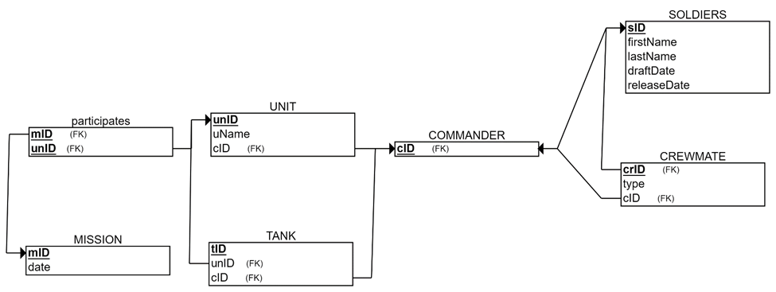
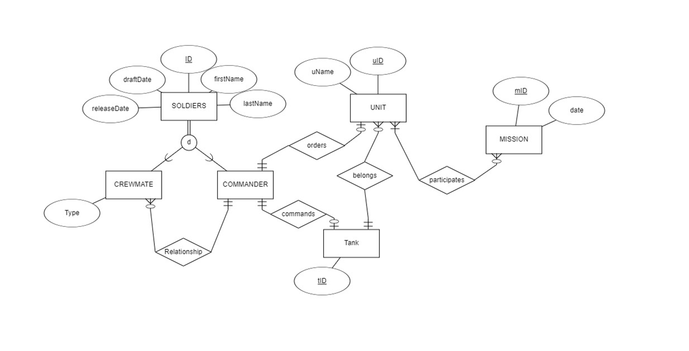
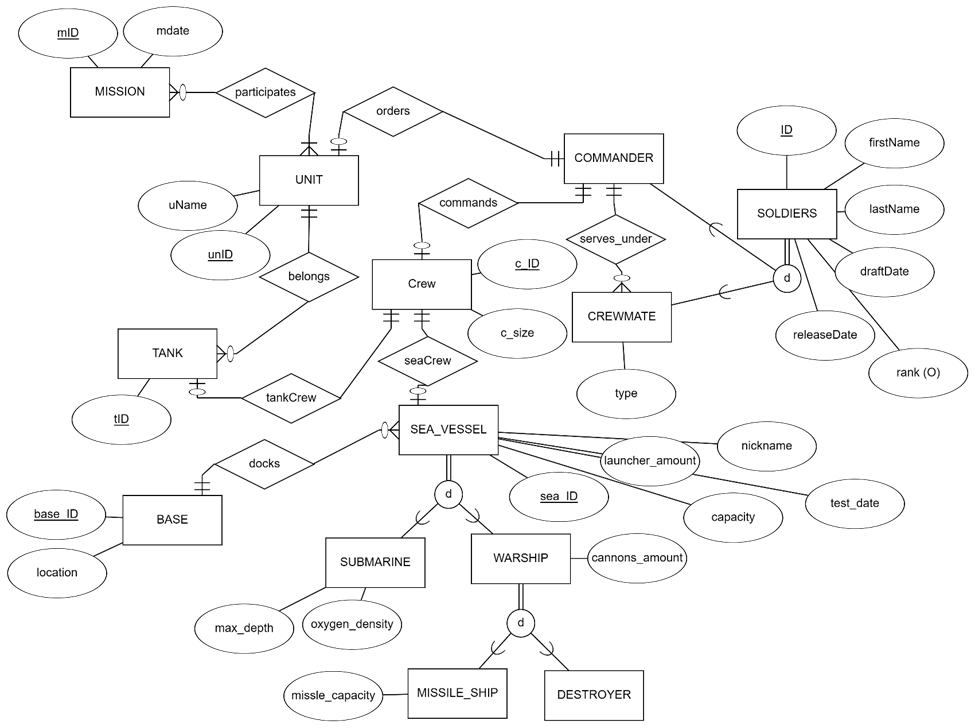
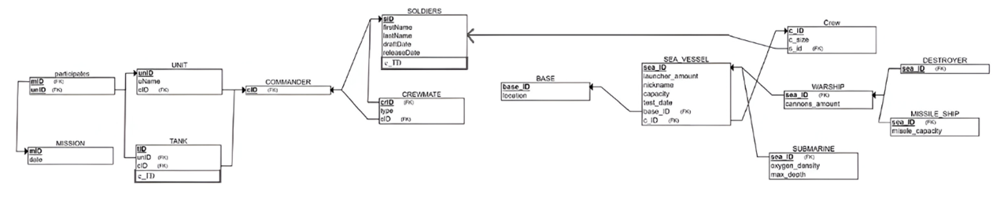

 # מסד נתונים לניהול חיל הים🚢

אלון ואן גלדר 216258483 ובעז זינגר 215444647

## תוכן עניינים

- [שלב 1: עיצוב ויצירת מסד נתונים](#שלב-1-עיצוב-ויצירת-מסד-נתונים)  
  - [הקדמה](#הקדמה)
  - [דיאגמרת ERD](#erd-entity-relationship-diagram)
  - [דיאגרמת DSD](#dsd-data-structure-diagram)  
  - [סקריפטים בSQL](#סקריפטים)
  - [הכנסת מידע לטבלאות](#הכנסת-מידע-לטבלאות)
  - [גיבוי](#גיבוי)  
- [שלב 2: שאילתות](#שלב-2-שאילתות)
  - [שאילתות](#שאילתות)
  - [אילוצים](#אילוצים)  
  - [גיבוי](#גיבוי-2)
- [שלב 3: אינטגרציה ומבטים](#שלב-3-אינטגרציה-ומבטים)
  - [אינטגרציה](#אינטגרציה)
  - [עדכון בסיס נתונים](#עדכון-בסיס-הנתונים)
  - [מבטים](#מבטים)
  - [גיבוי](#גיבוי-3)  
- [שלב 4: תכנות](#שלב-4-תכנות)
  - [פונקציות](#פונקציות)
  - [פרוצדורות](#פרוצדורות)
  - [טריגרים](#טריגרים)
  - [תוכניות](#תוכניות)  

## שלב 1: עיצוב ויצירת מסד נתונים

### הקדמה
מסד הנתונים נועד לנהל ביעילות מידע על כלי שיט, צוותים, חיילים ובסיסים. המערכת מאפשרת מעקב אחר כלי שיט שונים, שיוכם לבסיסים, הצוותים המוצבים בהם, נתוני בדיקות, ופרטים אישיים של החיילים והצוותים.

#### מטרת המבנה נתונים

-ניהול כלי שיט הכוללים משחתות, צוללות, ספינות טילים וספינות מלחמה.

-שיוך כלי שיט לבסיסים ימיים ולצוותים מתאימים.

-מעקב אחר בדיקות תקופתיות של כלי השיט ונתונים תפעוליים חשובים.

-ניהול כוח האדם, הכולל צוותים, חיילים ודירוגים צבאיים.

ניהול פרטי צוותי הספינות והחיילים המשרתים בחיל הים.

#### מקרי שימוש עקריים
-מפקדי חיל הים יכולים לנהל כלי שיט ולשבץ צוותים בהתאם לכשירותם ולצרכים המבצעיים.

-מנהלי בסיסים יכולים לפקח על כלי שיט השייכים לבסיס ולנהל את הצוותים המקומיים.

-חיילים ואנשי צוות יכולים להתעדכן בפרטי כלי השיט שלהם, בבדיקות שנעשו, ובנתוני הצוותים השייכים לכל ספינה.

#### יתרונות המערכת
✔ ניהול קל של כלי שיט עם היררכיית סוגים.

✔ מעקב אחרי צוותים ובסיסים רלוונטיים.

✔ אחסון נתוני חיילים ודרגותיהם.

✔ גישה נוחה למידע תפעולי של חיל הים.

###  ERD (Entity-Relationship Diagram)    

  

###  DSD (Data Structure Diagram)   
  

###  סקריפטים:

- **סקריפט יצירת טבלאות:** 

✍🏻 **[`createTables.sql`](Stage1/scripts/createTables.sql)**  

- **סקריפט הכנסה לטבלאות:**

✍🏻 **[`insertTables.sql`](Stage1/scripts/insertTables.sql)**  
 
- **סקריפט מחיקת טבלאות:** 

✍🏻 **[`dropTables.sql`](Stage1/scripts/dropTables.sql)**  

- **סקריפט בחירת כל המידע מהטבלאות:**  

✍🏻 **[`selectAll.sql`](Stage1/scripts/selectAll.sql)**  

###  הכנסת מידע לטבלאות:

####  כלי ראשון: שימוש באתר [mockaro](https://www.mockaroo.com/) על מנת ליצור קובץ CSV, תקיית כל הקבצים:  **[`mockarooFiles`](Stage1/mockarooFiles)**  
דוגמא ליצירת הקבצים עבור Submarine:

ככה נעשה עבור כל הטבלאות

####  כלי שני: יצירת סקריפט בפייתון ✍🏻 **[`insert.py`](Stage1/Programing/insert.py)**  

####  כלי שלישי: שימוש באתר [generatedata](https://generatedata.com/generator) על מנת ליצור קובץ SQL, תקיית כל הקבצים: **[`generatedataFiles`](Stage1/generatedataFiles )**  
דוגמא ליצירת הקבצים עבור Sea_vessel:

### גיבוי

קבצי גיבוי נשמרים עם התאריך של הגיבוי: [לתיקיית הגיבויים](Stage1/Backup)
- ניכנס ל Tools -> Backup וניצור קובץ גיבוי עבור המבנה נתונים שלנו.

- לאחר מכן נבצע Rstore על מנת לראות שהגיבוי עובד:

## שלב 2: שאילתות

###  שאילתות

####  כל 8 שאילתות הבחירה, 3 המחיקה ו3 העדכון נמצאים בתיקייה:  **[`Queries`](Stage2/Queries)**  
עבור כל שאילתה נראה מה היא עושה, צילום של הרצת השאילתה ותוצאת השאילתה:

### Select:

שאילתה מס 1:  ממוצע עומק הצלילה של צוללות לפי דרגת המפקד של הצוות שלהן

שאילתה מס 2: סכום התותחים מחולק במספר כלי שיט בכל בסיס

שאילתה מס 3: מוצא את הבסיס עם הכי הרבה כלי ים

שאילתה מס 4: המספר הממוצע של תותחים על ספינות מלחמה בשנה וחודש של תאריך הבדיקה שלהם

שאילתה מס 5: מחזיר את מספר ספינות מלחמה, צוללות, ספינות טילים ומשחתות לכל בסיס, מקובצים לפי מיקום הבסיס.

שאילתה מס 6: מחשב את המספר הממוצע של תותחים על ספינות מלחמה לכל בסיס

שאילתה מס 7: כל הספינות שבדקו אותן בשנה הנוכחית, כולל שם הצוות, בסיס ומספר חיילים בצוות

שאילתה מס 8: רשימת ספינות שתוקף ההשכרה שלהן יפוג תוך פחות מחצי שנה

- **שאילתות delete**

שאילתה מס 1:  מחיקת צוללות שצפיפות החמצן שלהם נמוכה מהממוצע של כמות המשגרים בכלי השיט בתוספת 10

לפני:

אחרי:

שאילתה מס 2: השאילתה מוחקת חיילים בדרגת סיילור שלא משמשים כמפקדים וששייכים לצוותים שלהם כלי שיט שנבדק לפני 2015.

לפני:

אחרי:

שאילתה מס 3:  מחיקת חיילים שמשרתים בצוותים שלא משויכים לאף כלי שיט, ושדרגתם היא סיילור ושלא משתמשים כמפקדים

נשאר ללא שינוי אחרי השאילתה.

- **שאילתות update**

שאילתה מס 1:  מעדכן את גודל כל צוות לפי מספר החיילים בו ועוד עשירית מסך הקיבולת של כלי השיט המשויכים לו.

לפני:

אחרי:

שאילתה מס 2:  השאילתה מעדכנת את תאריך סיום ההשכרה של כלי שיט שנבדקו לפני 2024 ושייכים לבסיסים שיש בהם לפחות שלושה צוותים שונים, על ידי הוספת חודשיים לתאריך.

לפני: 

אחרי:

שאילתה מס 3: השאילתה מעדכנת את שמות החיילים בדרגת קפטן בצוותים שלהם יש כלי שיט שנבדקו לפני שנת 2023 ובעלי קיבולת מצטברת גבוהה מ-1, על ידי הוספת תחילית לשם

לפני:

אחרי:

###  אילוצים:
אילוץ מס 1: הערך בעמודה max_depth חייב להיות חיובי (גדול מ-0).

אילוץ מס 2:   עמודת lease_expiration_date הפכה לחובה – אי אפשר להשאיר אותה ריקה.

אילוץ מס 3:  אם לא מצוין ערך בעמודת rank, תינתן לו ברירת המחדל "sailor".

###  RollbackCommit:

- **rollback**

- שלב ראשון - begin

- שלב שני - עדכון הטבלה

- שלב שלישי - הדפסת הטבלה המעודכנת

- שלב רביעי - rollback

- שלב חמישי - הדפסת הטבלה המקורית

- **commit**

- שלב ראשון - begin

- שלב שני - עדכון הטבלה

- שלב שלישי - הדפסת הטבלה המעודכנת

- שלב רביעי - commit

- שלב חמישי - הדפסת הטבלה המעודכנת

### גיבוי 2

קבצי גיבוי נשמרים עם התאריך של הגיבוי: [לתיקיית הגיבויים](Stage2/Backup)
- ניכנס ל Tools -> Backup וניצור קובץ גיבוי עבור המבנה נתונים שלנו.

- לאחר מכן נבצע Rstore על מנת לראות שהגיבוי עובד:

## שלב 3: אינטגרציה ומבטים

הזוג שאנחנו עושים איתו אינטגרציה הם יניב טל ואהוביה בצלאל והנושא שלהם הוא חיל השיריון.

מתוך קובץ הגיבוי שלהם נבנה תרשים DSD:

  

נבצע reverse engineering:
  

### אינטגרציה:

לאחר מכן ניצור את הERD  המשותף:

  

לאחר מחשבה, הבנו שהדרך הנכונה לשלב בין שני תרשימי ה-ERD היא לחבר את סכמת הSoldiers שלנו לסכמת הSoldier של הקבוצה השנייה.
אותו הדבר נעשה לגבי סכמת הCommander.
לאחר מכן, החלטנו שהסכמה crew תהיה הסכמה המקשרת בין התרשימים -  אליה פונות הן הסכמות שלנו, כמו סכמת sea_vessel ו commander והן הסכמות של הקבוצה השנייה, כמו סכמת ה tank.

דיאגרמת DSD משותף:

  

### עדכון בסיס הנתונים:

✍🏻 **[`Integration.sql`](Stage3/Integration.sql)**  

###  מבטים:
מבט ראשון:

מבט מנקודת המבט של חיל הים 

מה המבט מציג?
המבט v_all_ships מציג רשימה של כל כלי השיט הקיימים במערכת, כולל שיוך שלהם לסוג ספציפי, מיקום הבסיס שלהם, וקיבולת. הוא משלב מידע ממספר טבלאות שקשורות ל־חיל הים, ונותן תצוגה אחודה ונוחה.

שאילתה 1:

מה היא עושה?

השאילתה תספור ותחזיר את הכמות של כל סוג של ספינות שקיימות במאגר.

שאילתה 2:

מה היא עושה?
השאילתה תחזיר את כל הבסיסים שמשחתות חונות באותו הבסיס. כאשר מספר המשחתות החונות יחושב ויוצג.

מבט שני:

מבט מנקודת המבט של חיל השריון

מה המבט מציג?
המבט ARMOR_TANKS_MISSIONS_VIEW מציג רשימה של טנקים ופרטי השתתפותם במשימות, והוא מתמקד בנתונים השייכים ל־חיל השריון.

 שאילתה 1:

מה היא עושה?

מביאה את כל הטנקים והמשימות בהן השתתפו.
מאפשרת לראות מיפוי של כל הטנקים לכל משימה.

שאילתה 2:

מה היא עושה?

בוחרת רק טנקים שהשתתפו במשימות שהתקיימו לאחר 1 בינואר 2023.
מאפשרת להתמקד במשימות חדשות/עדכניות.

נראה בבסיס נתונים את שני המבטים שיצרנו:

### גיבוי 3

קבצי גיבוי נשמרים עם התאריך של הגיבוי: [לתיקיית הגיבויים](Stage3/Backup)
- ניכנס ל Tools -> Backup וניצור קובץ גיבוי עבור המבנה נתונים שלנו.

- לאחר מכן נבצע Rstore על מנת לראות שהגיבוי עובד:

## שלב 4: תכנות

### פונקציות:  

פונקציה 1 – ניתוח ביצועי מפקדים ✍🏻 **[`function1.sql`](Stage4/function1.sql)** 
שם: fn_commander_performance()

מטרה: לספק מדד איכות על פי מספר טנקים ומבצעים שכל מפקד היה אחראי עליהם.

תיאור כללי:
הפונקציה מחזירה RefCursor עם מידע על מפקדים, כולל דירוג ניסיון ("Experienced", "Intermediate", "Newbie") לפי מספר המשימות שניהלו. הנתונים נאספים מטבלאות Crew, Tank, Unit ו־Mission.

פונקציה 2 – סיכום חיילים לפי יחידות ✍🏻 **[`function2.sql`](Stage4/function1.sql)** 
שם: fn_soldier_unit_summary(commander_id INT)

מטרה: להחזיר עבור מפקד מסוים את כל החיילים שתחת פיקודו, כולל היחידה, הטנק והתפקיד שלהם בצוות.

תיאור כללי:
מתבצעים קשרים בין Soldier → Crew → Tank → Unit → CrewMate לפי מזהה מפקד נתון. כל חייל משויך ליחידה ולטנק, ומוצג תפקידו בצוות.

נסתכל ונראה בבסיס נתונים את העדכון:

### פרוצדורות:

### טריגרים:

### תוכניות:

