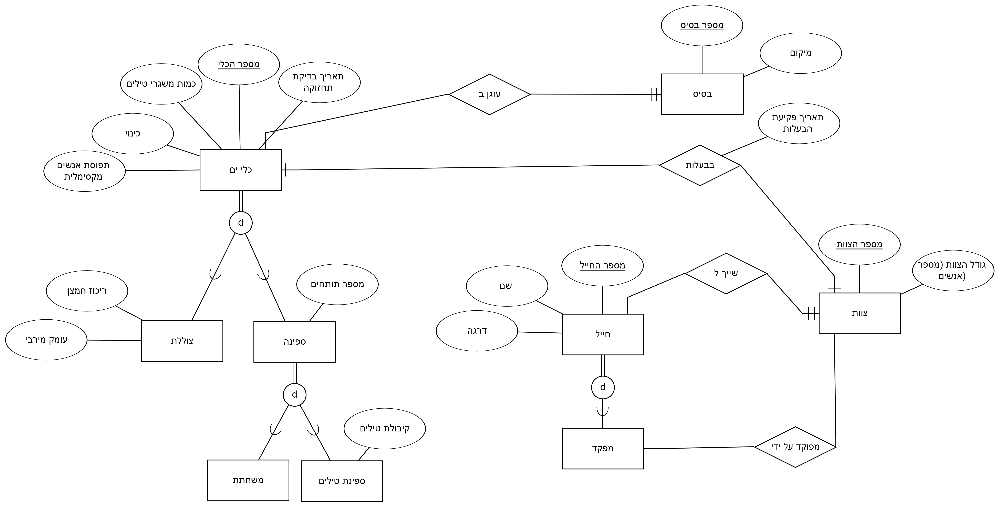
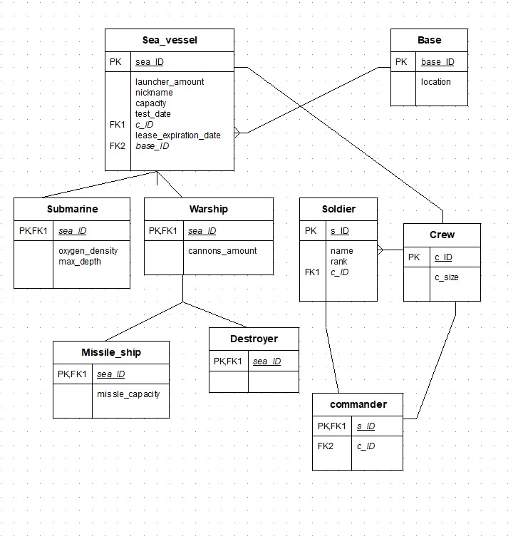

# מסד נתונים לניהול חיל הים🚢

אלון ואן גלדר 216258483 ובעז זינגר 215444647

## תוכן עניינים

- [שלב 1: עיצוב ויצירת מסד נתונים](#שלב-1-עיצוב-ויצירת-מסד-נתונים)  
  - [הקדמה](#הקדמה)
  - [דיאגמרת ERD](#erd-entity-relationship-diagram)
  - [דיאגרמת DSD](#dsd-data-structure-diagram)  

## שלב 1: עיצוב ויצירת מסד נתונים

### הקדמה
מסד הנתונים נועד לנהל ביעילות מידע על כלי שיט, צוותים, חיילים ובסיסים. המערכת מאפשרת מעקב אחר כלי שיט שונים, שיוכם לבסיסים, הצוותים המוצבים בהם, נתוני בדיקות, ופרטים אישיים של החיילים והצוותים.

#### מטרת המבנה נתונים

-ניהול כלי שיט הכוללים משחתות, צוללות, ספינות טילים וספינות מלחמה.

-שיוך כלי שיט לבסיסים ימיים ולצוותים מתאימים.

-מעקב אחר בדיקות תקופתיות של כלי השיט ונתונים תפעוליים חשובים.

-ניהול כוח האדם, הכולל צוותים, חיילים ודירוגים צבאיים.

ניהול פרטי צוותי הספינות והחיילים המשרתים בחיל הים.

#### מקרי שימוש עקריים
-מפקדי חיל הים יכולים לנהל כלי שיט ולשבץ צוותים בהתאם לכשירותם ולצרכים המבצעיים.

-מנהלי בסיסים יכולים לפקח על כלי שיט השייכים לבסיס ולנהל את הצוותים המקומיים.

-חיילים ואנשי צוות יכולים להתעדכן בפרטי כלי השיט שלהם, בבדיקות שנעשו, ובנתוני הצוותים השייכים לכל ספינה.

#### יתרונות המערכת
✔ ניהול קל של כלי שיט עם היררכיית סוגים.

✔ מעקב אחרי צוותים ובסיסים רלוונטיים.

✔ אחסון נתוני חיילים ודרגותיהם.

✔ גישה נוחה למידע תפעולי של חיל הים.

###  ERD (Entity-Relationship Diagram)    

  

###  DSD (Data Structure Diagram)   
  

###  SQL Scripts  

